# Uppgifter

G

- [x] Få projektet att funka
- [x] CSS till Sass
- [x] Enhetlig namngivning i CSS:en
- [x] Konvertera till TypeScript
- [x] Enhetlig kodkvalitet
- [x] Mobilvyn
- [x] Språk
- [x] Rensa loggning
- [x] Dokumentation
- [x] Tillgänglighet (bilder)
- [x] Tillgänglighet (HTML-kod)
- [x] Refaktorera funktioner
- [x] Eliminera onödig kod
- [x] Rensa bort kod som inte ska sättas
- [x] Infoga skärmdumpar på commit-meddelanden i README-filen
- [x] Infoga skärmdumpar på branches i README-file

## Commit messages:

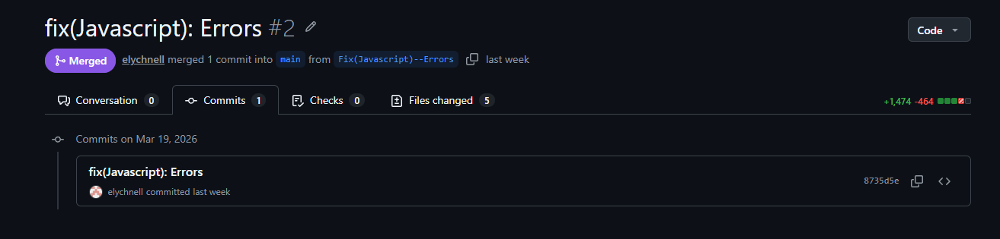
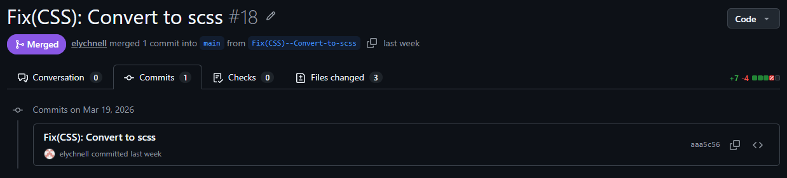
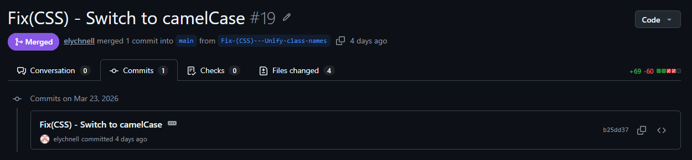
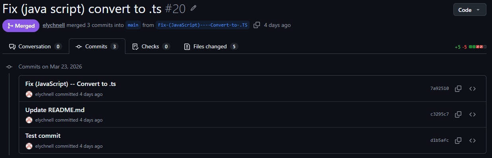
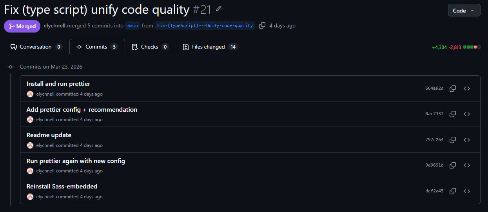
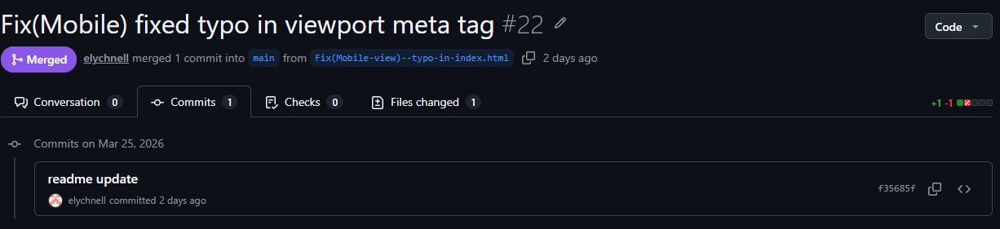
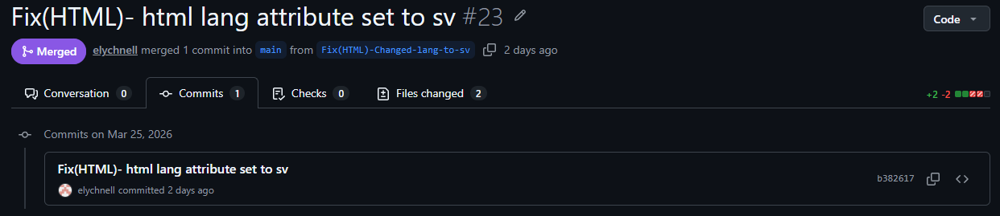
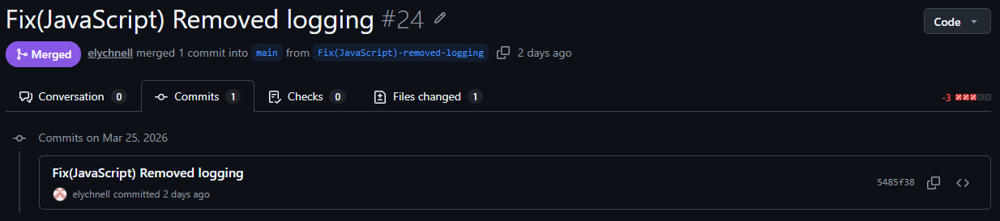
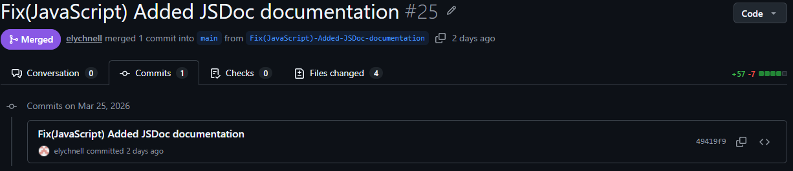
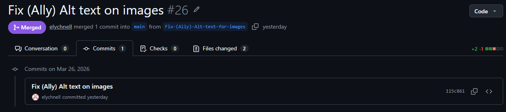
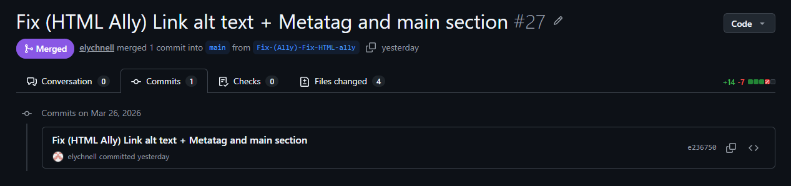
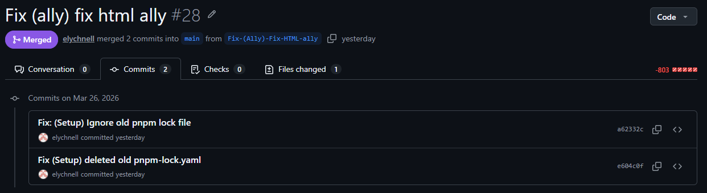
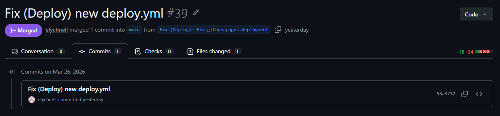
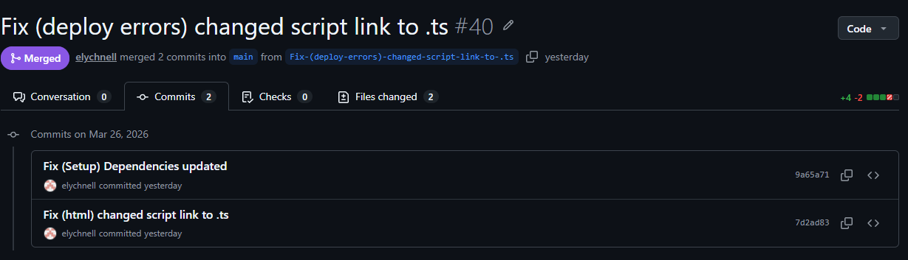
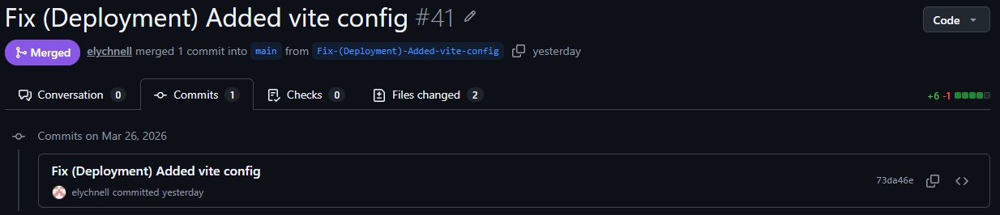
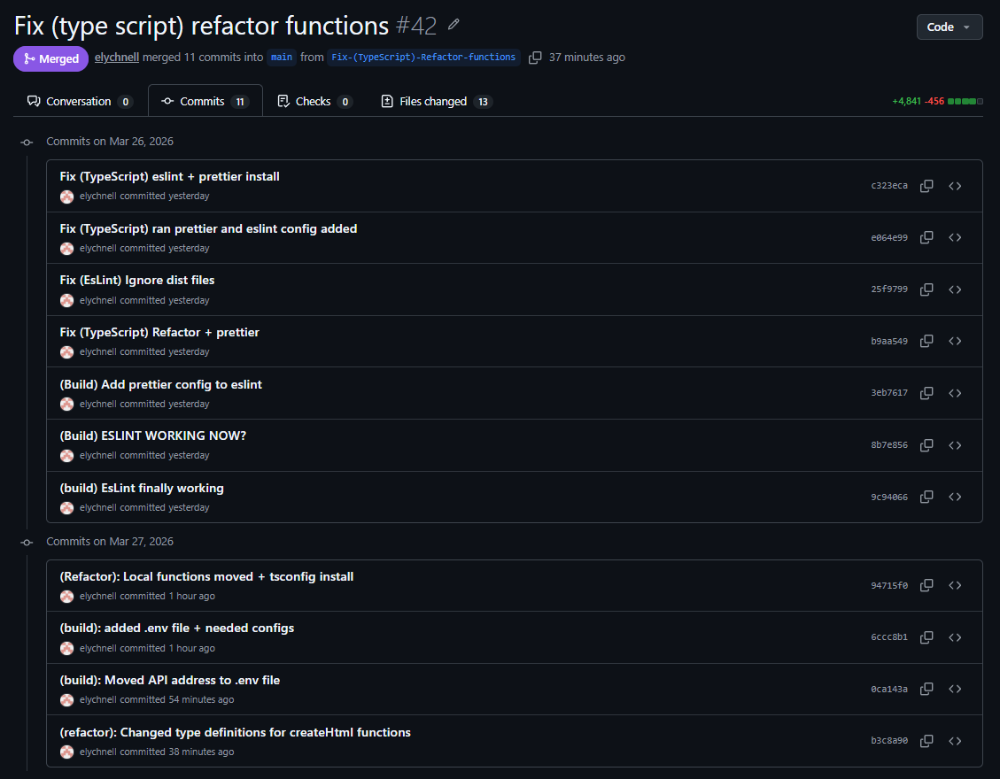

## Branches:

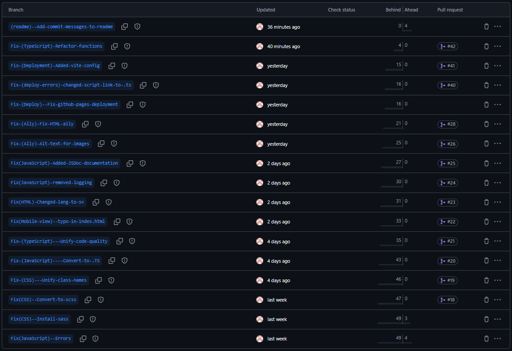
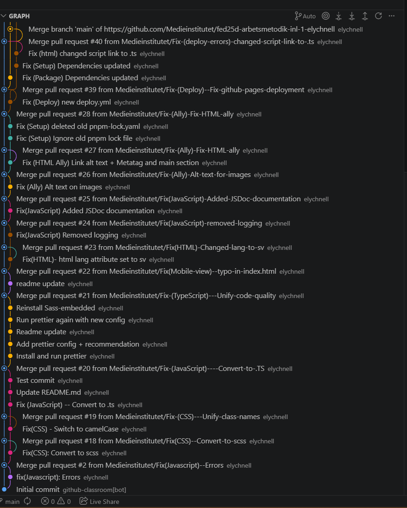
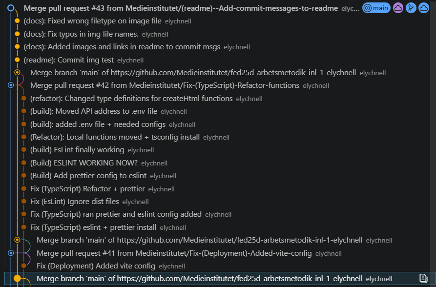

VG

- [ ] Rätt sak på rätt plats
- [ ] Hantera loggning på ett effektivt sätt
- [ ] Gör en tillgänglighetsgranskning av sidan
- [ ] Utnyttja features i Sass i CSS:en
- [ ] Rensa bort paket som inte används
- [ ] Hantera fel i API-anropet
- [ ] Gör en Lighthouse-analys
- [ ] Läs av utvecklingsmiljön
- [ ] Enhetlig syntax i CSS:en
- [x] Publicera sidan på GitHub pages
